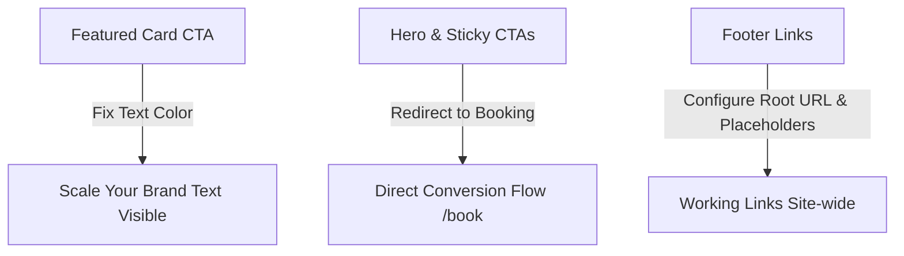

# Implementation Plan - UI Improvements & Button Audit

This plan outlines the implementation details for two sets of improvements to the GS Legacy Wealth website:
1. Fixing the invisible "Scale Your Brand" CTA button text on the featured pricing tier card.
2. Auditing and updating every button and link throughout the site to ensure full responsiveness, consistent styling, and logical routing.

---

## User Review Required

Please review the proposed adjustments below:

> [!IMPORTANT]
> **Primary Routing Change**:
> Currently, several primary call-to-actions (such as in the Hero and Sticky CTA elements) lead to `/#contact` (an anchor to the CTA section). We propose directing these directly to the high-converting `/book` strategy page to drive more direct qualified bookings.
> 
> **Social Media & Policy Placeholders**:
> The footer social media links (Instagram, LinkedIn, Twitter) and pages (Privacy Policy, Terms of Service) currently lead to `#`. We will configure clean placeholder routing for pages and prepare social links with proper outbound window attributes (`target="_blank" rel="noopener noreferrer"`).

---

## Proposed Changes

### 1. Pricing Page Adjustments

#### [MODIFY] [pricing.tsx](file:///c:/Users/Deepg/OneDrive/Desktop/The%20Real%20World/Campuses/AI%20Automation/New%20Lessons/CODING/v0-gs-legacy-wealth-app/components/pricing.tsx)
*   **Problem**: The "Scale Your Brand" text is invisible on the featured card because of insufficient contrast (light/gold text on a gold gradient background).
*   **Change**: Add `text-black` (forces text contrast) and `font-extrabold tracking-wide` (elevates prominence) to the featured button's className list.

---

### 2. Main Page Header & CTA Redirects

#### [MODIFY] [hero.tsx](file:///c:/Users/Deepg/OneDrive/Desktop/The%20Real%20World/Campuses/AI%20Automation/New%20Lessons/CODING/v0-gs-legacy-wealth-app/components/hero.tsx)
*   **Change**: Update "Book Your Free Strategy Call" primary CTA from `/#contact` to `/book`.
*   **Change**: Update "Get Free AI Website Audit" secondary CTA from `/#contact` to `/book` (or keep as `/#contact` if a separate layout/form is added later, but recommended `/book` for now).

#### [MODIFY] [sticky-cta-button.tsx](file:///c:/Users/Deepg/OneDrive/Desktop/The%20Real%20World/Campuses/AI%20Automation/New%20Lessons/CODING/v0-gs-legacy-wealth-app/components/sticky-cta-button.tsx)
*   **Change**: Update the floating button navigation link from `/#contact` to `/book` so it routes to the strategy scheduler.

---

### 3. Footer Styling & Reference Fixes

#### [MODIFY] [footer.tsx](file:///c:/Users/Deepg/OneDrive/Desktop/The%20Real%20World/Campuses/AI%20Automation/New%20Lessons/CODING/v0-gs-legacy-wealth-app/components/footer.tsx)
*   **Change**: Change footer logo link `href="#home"` to `href="/"` so it routes back to home from any sub-page.
*   **Change**: Configure placeholders or link parameters for social links and policy links so they do not crash or lead to dead-ends.

---

## Verification Plan

### Automated Tests
*   Run `npm run build` to verify there are no compilation errors or broken typescript mappings across updated elements.

### Manual Verification
1.  **Contrast & Contrast Check**: Inspect the "Scale Your Brand" button on the pricing card in dark and light modes, verifying the text is fully legible to the human eye.
2.  **Navigation Check**: Click every button in the Header, Hero, Pricing section, Sticky Widget, and Footer:
    *   Verify navbar "Book a Strategy Call" goes to `/book`.
    *   Verify hero primary CTA goes to `/book`.
    *   Verify pricing card setups go to `/book?tier=Launch`, `/book?tier=Legacy`, and `/book?tier=Elite`.
    *   Verify sticky button goes to `/book`.
    *   Verify footer logo returns to the landing page `/` from the pricing/book sub-pages.
