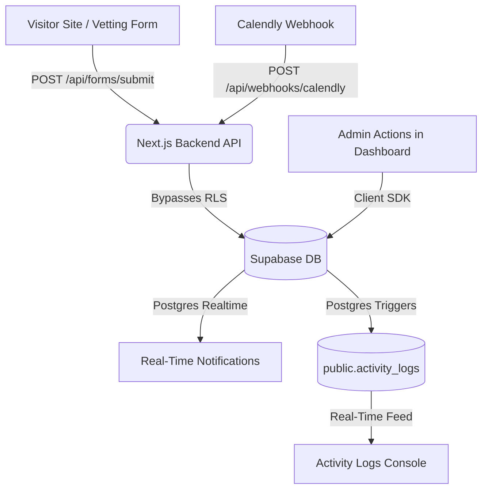

# Implementation Plan - Admin Dashboard & Backend Refinement

This document outlines the technical plan to upgrade the GS Legacy Wealth Admin Dashboard and backend integrations to premium, production-grade standards.

---

## User Review Required

We have identified several critical architecture enhancements and require your sign-off before proceeding:

> [!IMPORTANT]
> **1. Unified Console Navigation (Removal of PortalHub)**
> We propose removing the `PortalHub` (the floating column of icon buttons on the left edge) from the Admin Dashboard layout. It is visually redundant and takes up unnecessary horizontal space. Instead, we will integrate a premium "Console Switcher" dropdown/combobox at the top of the `AdminSidebar` (under the logo) or clearly-labeled portal links at the bottom of the sidebar. This will consolidate navigation into a single, clean sidebar. We will flag this for Client and User layouts to be resolved in a future pass.

> [!IMPORTANT]
> **2. Contextual Telemetry (Console Inspector)**
> To make the "Console Inspector" in the header functional and highly useful, we propose adding an "Inspect" icon button (using the Lucide `Activity` or `Info` icon) next to each row in the Leads table, Projects table, and Client Directory table. Clicking "Inspect" will update the search parameters in the URL (e.g. `?leadId=...`) and automatically slide open the Console Inspector panel on the right side of the screen. The row currently being inspected will be visually highlighted with a golden glow. This creates a multi-pane command-center experience.

> [!WARNING]
> **3. Database Migration for CMS Data Structures**
> The current database tables for `portfolio_items` and `testimonials` do not support the visual attributes required by the live website (e.g., gradients, metrics, badges, under-construction states). We will need to write a migration adding the following columns:
> - `portfolio_items`: `gradient` (TEXT), `metric` (TEXT), `under_construction` (BOOLEAN DEFAULT TRUE)
> - `testimonials`: `badge` (TEXT)
>
> We will also supply a database seed script to populate these tables with the current hardcoded content so the site remains identical upon connection.

> [!IMPORTANT]
> **4. Database Trigger-Based Activity Audit Logs**
> Rather than manually writing database log queries in every API route and UI handler, we will create a centralized PostgreSQL trigger function `public.log_activity_changes()`. This will automatically capture all creation, status modifications, messaging, and system sign-ins across the database and write them in real-time to the `activity_logs` table.

---

## Proposed Changes



### Component: Navigation & Layout

#### [MODIFY] [layout.tsx](file:///c:/Users/Deepg/OneDrive/Desktop/The%20Real%20World/Campuses/AI%20Automation/New%20Lessons/CODING/v0-gs-legacy-wealth-app/app/(admin)/layout.tsx)
- Remove the `<PortalHub />` component from the layout tree.
- Adjust grid/padding constraints to account for the single-sidebar structure.

#### [MODIFY] [sidebar.tsx](file:///c:/Users/Deepg/OneDrive/Desktop/The%20Real%20World/Campuses/AI%20Automation/New%20Lessons/CODING/v0-gs-legacy-wealth-app/components/admin/sidebar.tsx)
- Integrate a premium, styled "Console Switcher" dropdown under the logo.
- The switcher will contain links to:
  - **Operations Terminal** (Admin Portal - `/admin`)
  - **Sovereign Partner Console** (Client Portal - `/client`)
  - **Vetting Terminal** (User Dashboard - `/dashboard`)
  - **Public Site** (Home - `/`)
- Reorganize sidebar navigation links to match the new brand tone.

---

### Component: CRM Telemetry & Webhooks

#### [MODIFY] [route.ts](file:///c:/Users/Deepg/OneDrive/Desktop/The%20Real%20World/Campuses/AI%20Automation/New%20Lessons/CODING/v0-gs-legacy-wealth-app/app/api/forms/submit/route.ts)
- Modify error-handling: If the database write fails or `supabaseAdmin` is not initialized, return a `500 Internal Server Error` with detailed diagnostics rather than returning `200 OK` with `success: true`. This prevents the UI from hiding database failures.

#### [NEW] [route.ts](file:///c:/Users/Deepg/OneDrive/Desktop/The%20Real%20World/Campuses/AI%20Automation/New%20Lessons/CODING/v0-gs-legacy-wealth-app/app/api/webhooks/calendly/route.ts)
- Implement a secure Calendly Webhook endpoint using the Next.js App Router:
  - Listen for `invitee.created` and `invitee.canceled` events.
  - On `invitee.created`: Match the email address. If no lead exists, create a new lead (parsing company details and website from Calendly custom questions). Update lead status to `'Call Booked'` and upsert the strategy session in `strategy_sessions` as `'Scheduled'`.
  - On `invitee.canceled`: Locate the scheduled session by its Calendly event URI/ID, set its status to `'Canceled'`, and update the lead's status to `'Contacted'`.
  - Bypasses RLS utilizing the server-side admin key client.

---

### Component: Notifications & Communication Desk

#### [MODIFY] [notification-center.tsx](file:///c:/Users/Deepg/OneDrive/Desktop/The%20Real%20World/Campuses/AI%20Automation/New%20Lessons/CODING/v0-gs-legacy-wealth-app/components/admin/notification-center.tsx)
- Refactor the component to load existing notification history from the `user_notifications` table in Supabase upon mounting.
- Change the Postgres Realtime subscription to listen only to the `user_notifications` table for the logged-in admin (`user_id = currentAdminId`), updating the notification count and list dynamically.
- Clean up raw, direct client-side table subscriptions (`leads`, `messages`, `strategy_sessions`) to avoid redundant memory allocations and sync issues.

#### [MODIFY] [page.tsx](file:///c:/Users/Deepg/OneDrive/Desktop/The%20Real%20World/Campuses/AI%20Automation/New%20Lessons/CODING/v0-gs-legacy-wealth-app/app/(admin)/admin/messages/page.tsx)
- Fix permission prompt recurrence: Before triggering `Notification.requestPermission()`, check if `localStorage.getItem('gs-messages-alert-prompted') === 'true'`. If so, skip asking.
- Set the `gs-messages-alert-prompted` flag to `'true'` in `localStorage` once the user handles the prompt.

#### [MODIFY] [page.tsx](file:///c:/Users/Deepg/OneDrive/Desktop/The%20Real%20World/Campuses/AI%20Automation/New%20Lessons/CODING/v0-gs-legacy-wealth-app/app/(admin)/admin/projects/[id]/page.tsx)
- Add a message delete function `handleDeleteMessage(messageId: string)` that deletes the message from the `messages` table in Supabase.
- In the message bubbles render: Add a small, hovered Trash icon next to both admin and client messages to trigger the delete action.
- Update the Postgres realtime channel inside this component to subscribe to both `INSERT` and `DELETE` events on the `messages` table, updating the state in real-time without requiring a page refresh.

#### [MODIFY] [messages-client-container.tsx](file:///c:/Users/Deepg/OneDrive/Desktop/The%20Real%20World/Campuses/AI%20Automation/New%20Lessons/CODING/v0-gs-legacy-wealth-app/components/client/messages-client-container.tsx)
- Implement the same `localStorage` check for notification permissions to prevent recurring browser popups in the client portal.

---

### Component: Project Configuration Fields

#### [MODIFY] [page.tsx](file:///c:/Users/Deepg/OneDrive/Desktop/The%20Real%20World/Campuses/AI%20Automation/New%20Lessons/CODING/v0-gs-legacy-wealth-app/app/(admin)/admin/projects/[id]/page.tsx)
- Declare state variables for `serviceType` and `description`.
- Initialize them in `useEffect` from the project record.
- In `handleSave`, append `service_type` and `description` to the `.update(...)` payload.
- Replace the disabled `Service Type` input with a standard editable text input.
- Replace the static text rendering of the project description with an editable `<textarea>` within the Project Configuration card.

---

### Component: Client Directory & Deletion

#### [MODIFY] [page.tsx](file:///c:/Users/Deepg/OneDrive/Desktop/The%20Real%20World/Campuses/AI%20Automation/New%20Lessons/CODING/v0-gs-legacy-wealth-app/app/(admin)/admin/clients/page.tsx)
- Verify modal z-indexes and overlay properties to ensure the keyboard focus flows correctly.
- Add an `autoFocus` property to the delete confirmation input.
- Ensure the delete confirm state updates correctly on change.
- Create a Row Level Security policy in Supabase to allow authenticated users to record their own logins:
  ```sql
  CREATE POLICY "Users can insert their own logins" ON public.login_history
      FOR INSERT WITH CHECK (user_id = auth.uid());
  ```

---

### Component: Dynamic CMS & Media Integration

#### [NEW] [use-website-content.ts](file:///c:/Users/Deepg/OneDrive/Desktop/The%20Real%20World/Campuses/AI%20Automation/New%20Lessons/CODING/v0-gs-legacy-wealth-app/hooks/use-website-content.ts)
- Create a client-side hook `useWebsiteContent<T>(sectionKey: string, defaultContent: T)`:
  - Query the `website_content` table where `section_key = sectionKey`.
  - Returns the live JSON content from the database.
  - Falls back to `defaultContent` if the database query is empty or fails.

#### [MODIFY] [portfolio.tsx](file:///c:/Users/Deepg/OneDrive/Desktop/The%20Real%20World/Campuses/AI%20Automation/New%20Lessons/CODING/v0-gs-legacy-wealth-app/components/portfolio.tsx)
- Connect the component to fetch live showcase projects from `portfolio_items` in Supabase (filtering where `is_archived = false`).
- Fall back to the hardcoded array if database records are empty.

#### [MODIFY] [testimonials.tsx](file:///c:/Users/Deepg/OneDrive/Desktop/The%20Real%20World/Campuses/AI%20Automation/New%20Lessons/CODING/v0-gs-legacy-wealth-app/components/testimonials.tsx)
- Connect the component to fetch testimonials from `testimonials` in Supabase (filtering where `is_archived = false`).
- Fall back to the hardcoded array if database records are empty.

#### [MODIFY] [hero.tsx](file:///c:/Users/Deepg/OneDrive/Desktop/The%20Real%20World/Campuses/AI%20Automation/New%20Lessons/CODING/v0-gs-legacy-wealth-app/components/hero.tsx)
- Load hero copy dynamically utilizing `useWebsiteContent`.

#### [MODIFY] [cta.tsx](file:///c:/Users/Deepg/OneDrive/Desktop/The%20Real%20World/Campuses/AI%20Automation/New%20Lessons/CODING/v0-gs-legacy-wealth-app/components/cta.tsx)
- Load CTA copy dynamically utilizing `useWebsiteContent`.

#### [MODIFY] [process.tsx](file:///c:/Users/Deepg/OneDrive/Desktop/The%20Real%20World/Campuses/AI%20Automation/New%20Lessons/CODING/v0-gs-legacy-wealth-app/components/process.tsx)
- Load process stages dynamically utilizing `useWebsiteContent`.

#### [MODIFY] [faq-home.tsx](file:///c:/Users/Deepg/OneDrive/Desktop/The%20Real%20World/Campuses/AI%20Automation/New%20Lessons/CODING/v0-gs-legacy-wealth-app/components/faq-home.tsx)
- Load FAQ items dynamically utilizing `useWebsiteContent`.

#### [MODIFY] [footer.tsx](file:///c:/Users/Deepg/OneDrive/Desktop/The%20Real%20World/Campuses/AI%20Automation/New%20Lessons/CODING/v0-gs-legacy-wealth-app/components/footer.tsx)
- Load copyright, phone, email, and social URLs dynamically utilizing `useWebsiteContent`.

#### [MODIFY] [brand-logo.tsx](file:///c:/Users/Deepg/OneDrive/Desktop/The%20Real%20World/Campuses/AI%20Automation/New%20Lessons/CODING/v0-gs-legacy-wealth-app/components/brand-logo.tsx)
- Fetch the brand logo URL and watermark URL dynamically from a `'branding'` section in `website_content`, falling back to the local static files defined in `brand-assets.ts`.

---

### Component: Activity Audit Logs

#### [MODIFY] [page.tsx](file:///c:/Users/Deepg/OneDrive/Desktop/The%20Real%20World/Campuses/AI%20Automation/New%20Lessons/CODING/v0-gs-legacy-wealth-app/app/(admin)/admin/logs/page.tsx)
- Implement a Postgres Realtime subscription for the `activity_logs` table inside the page component.
- When new activity occurs (like message deletion, lead insertion, booking updates), slide new logs in from the top with smooth animations.
- Refine log formatting: Add visual, color-coded badges and icons representing each action type (e.g. key icon for Auth, user icon for Leads).
- Add an expandable JSON inspector panel on each log item card to view the raw query telemetry and changes.

---

## Database Migrations

### [NEW] [20260627130000_audit_and_cms_refinements.sql](file:///c:/Users/Deepg/OneDrive/Desktop/The%20Real%20World/Campuses/AI%20Automation/New%20Lessons/CODING/v0-gs-legacy-wealth-app/supabase/migrations/20260627130000_audit_and_cms_refinements.sql)

```sql
-- 1. Add visual CMS columns to portfolio_items
ALTER TABLE public.portfolio_items 
  ADD COLUMN IF NOT EXISTS gradient TEXT,
  ADD COLUMN IF NOT EXISTS metric TEXT,
  ADD COLUMN IF NOT EXISTS under_construction BOOLEAN DEFAULT TRUE NOT NULL;

-- 2. Add badge column to testimonials
ALTER TABLE public.testimonials
  ADD COLUMN IF NOT EXISTS badge TEXT;

-- 3. Add insert policy for login_history so users can write their own logins
DROP POLICY IF EXISTS "Users can insert own logins" ON public.login_history;
CREATE POLICY "Users can insert own logins" ON public.login_history
  FOR INSERT WITH CHECK (user_id = auth.uid());

-- 4. Create centralized trigger function for activity logging
CREATE OR REPLACE FUNCTION public.log_activity_changes()
RETURNS TRIGGER AS $$
DECLARE
    v_user_id UUID;
    v_action TEXT;
    v_details JSONB;
BEGIN
    -- Capture auth user if available
    v_user_id := auth.uid();
    v_action := TG_OP;
    
    IF TG_TABLE_NAME = 'leads' THEN
        IF TG_OP = 'INSERT' THEN
            INSERT INTO public.activity_logs (user_id, action_type, target_table, target_id, details)
            VALUES (v_user_id, 'Lead Submission', 'leads', NEW.id, jsonb_build_object('name', NEW.name, 'business_name', NEW.business_name, 'source', NEW.source));
        ELSIF TG_OP = 'UPDATE' THEN
            IF OLD.status IS DISTINCT FROM NEW.status THEN
                INSERT INTO public.activity_logs (user_id, action_type, target_table, target_id, details)
                VALUES (v_user_id, 'Lead Status Change', 'leads', NEW.id, jsonb_build_object('name', NEW.name, 'old_status', OLD.status, 'new_status', NEW.status));
            ELSE
                INSERT INTO public.activity_logs (user_id, action_type, target_table, target_id, details)
                VALUES (v_user_id, 'Lead Update', 'leads', NEW.id, jsonb_build_object('name', NEW.name));
            END IF;
        END IF;
    ELSIF TG_TABLE_NAME = 'projects' THEN
        IF TG_OP = 'INSERT' THEN
            INSERT INTO public.activity_logs (user_id, action_type, target_table, target_id, details)
            VALUES (v_user_id, 'Project Created', 'projects', NEW.id, jsonb_build_object('project_name', NEW.project_name, 'client_name', NEW.client_name));
        ELSIF TG_OP = 'UPDATE' THEN
            IF OLD.status IS DISTINCT FROM NEW.status THEN
                INSERT INTO public.activity_logs (user_id, action_type, target_table, target_id, details)
                VALUES (v_user_id, 'Project Milestone Change', 'projects', NEW.id, jsonb_build_object('project_name', NEW.project_name, 'old_status', OLD.status, 'new_status', NEW.status));
            ELSE
                INSERT INTO public.activity_logs (user_id, action_type, target_table, target_id, details)
                VALUES (v_user_id, 'Project Config Update', 'projects', NEW.id, jsonb_build_object('project_name', NEW.project_name));
            END IF;
        END IF;
    ELSIF TG_TABLE_NAME = 'messages' THEN
        IF TG_OP = 'INSERT' THEN
            INSERT INTO public.activity_logs (user_id, action_type, target_table, target_id, details)
            VALUES (v_user_id, 'Message Sent', 'messages', NEW.id, jsonb_build_object('project_id', NEW.project_id));
        ELSIF TG_OP = 'DELETE' THEN
            INSERT INTO public.activity_logs (user_id, action_type, target_table, target_id, details)
            VALUES (v_user_id, 'Message Deleted', 'messages', OLD.id, jsonb_build_object('project_id', OLD.project_id));
        END IF;
    ELSIF TG_TABLE_NAME = 'project_updates' THEN
        IF TG_OP = 'INSERT' THEN
            INSERT INTO public.activity_logs (user_id, action_type, target_table, target_id, details)
            VALUES (v_user_id, 'Project Update Published', 'project_updates', NEW.id, jsonb_build_object('project_id', NEW.project_id, 'title', NEW.title));
        END IF;
    ELSIF TG_TABLE_NAME = 'strategy_sessions' THEN
        IF TG_OP = 'INSERT' THEN
            INSERT INTO public.activity_logs (user_id, action_type, target_table, target_id, details)
            VALUES (v_user_id, 'Booking Scheduled', 'strategy_sessions', NEW.id, jsonb_build_object('scheduled_at', NEW.scheduled_at));
        ELSIF TG_OP = 'UPDATE' THEN
            IF OLD.status IS DISTINCT FROM NEW.status THEN
                INSERT INTO public.activity_logs (user_id, action_type, target_table, target_id, details)
                VALUES (v_user_id, 'Booking Status Updated', 'strategy_sessions', NEW.id, jsonb_build_object('old_status', OLD.status, 'new_status', NEW.status));
            END IF;
        END IF;
    ELSIF TG_TABLE_NAME = 'login_history' THEN
        IF TG_OP = 'INSERT' THEN
            -- Record login as activity log
            INSERT INTO public.activity_logs (user_id, action_type, target_table, target_id, details)
            VALUES (NEW.user_id, 'Auth Sign-In', 'login_history', NEW.id, jsonb_build_object('ip_address', NEW.ip_address, 'user_agent', NEW.user_agent));
        END IF;
    END IF;

    RETURN NEW;
END;
$$ LANGUAGE plpgsql SECURITY DEFINER;

-- 5. Attach audit triggers to target tables
DROP TRIGGER IF EXISTS trigger_audit_leads ON public.leads;
CREATE TRIGGER trigger_audit_leads AFTER INSERT OR UPDATE ON public.leads FOR EACH ROW EXECUTE FUNCTION public.log_activity_changes();

DROP TRIGGER IF EXISTS trigger_audit_projects ON public.projects;
CREATE TRIGGER trigger_audit_projects AFTER INSERT OR UPDATE ON public.projects FOR EACH ROW EXECUTE FUNCTION public.log_activity_changes();

DROP TRIGGER IF EXISTS trigger_audit_messages ON public.messages;
CREATE TRIGGER trigger_audit_messages AFTER INSERT OR DELETE ON public.messages FOR EACH ROW EXECUTE FUNCTION public.log_activity_changes();

DROP TRIGGER IF EXISTS trigger_audit_project_updates ON public.project_updates;
CREATE TRIGGER trigger_audit_project_updates AFTER INSERT ON public.project_updates FOR EACH ROW EXECUTE FUNCTION public.log_activity_changes();

DROP TRIGGER IF EXISTS trigger_audit_strategy_sessions ON public.strategy_sessions;
CREATE TRIGGER trigger_audit_strategy_sessions AFTER INSERT OR UPDATE ON public.strategy_sessions FOR EACH ROW EXECUTE FUNCTION public.log_activity_changes();

DROP TRIGGER IF EXISTS trigger_audit_login_history ON public.login_history;
CREATE TRIGGER trigger_audit_login_history AFTER INSERT ON public.login_history FOR EACH ROW EXECUTE FUNCTION public.log_activity_changes();

-- 6. Add triggers to user_notifications for admin notification dispatch
CREATE OR REPLACE FUNCTION public.handle_admin_notifications()
RETURNS TRIGGER AS $$
DECLARE
    admin_record RECORD;
BEGIN
    -- Notify admins on lead submissions
    IF TG_TABLE_NAME = 'leads' AND TG_OP = 'INSERT' THEN
        FOR admin_record IN SELECT id FROM public.profiles WHERE role = 'admin' LOOP
            INSERT INTO public.user_notifications (user_id, title, description, link)
            VALUES (admin_record.id, 'New Vetting Lead', NEW.name || ' from ' || NEW.business_name, '/admin/leads/' || NEW.id);
        END LOOP;
    -- Notify admins on booking registrations
    ELSIF TG_TABLE_NAME = 'strategy_sessions' AND TG_OP = 'INSERT' THEN
        FOR admin_record IN SELECT id FROM public.profiles WHERE role = 'admin' LOOP
            INSERT INTO public.user_notifications (user_id, title, description, link)
            VALUES (admin_record.id, 'New Call Scheduled', 'Strategy session scheduled', '/admin/bookings');
        END LOOP;
    -- Notify admins on client message incoming
    ELSIF TG_TABLE_NAME = 'messages' AND TG_OP = 'INSERT' THEN
        -- Only notify if sender is a client (role != admin)
        IF EXISTS (SELECT 1 FROM public.profiles WHERE id = NEW.sender_id AND role != 'admin') THEN
            FOR admin_record IN SELECT id FROM public.profiles WHERE role = 'admin' LOOP
                INSERT INTO public.user_notifications (user_id, title, description, link)
                VALUES (admin_record.id, 'New Client Message', NEW.content, '/admin/messages');
            END LOOP;
        END IF;
    END IF;
    RETURN NEW;
END;
$$ LANGUAGE plpgsql SECURITY DEFINER;

DROP TRIGGER IF EXISTS trigger_notify_admin_lead ON public.leads;
CREATE TRIGGER trigger_notify_admin_lead AFTER INSERT ON public.leads FOR EACH ROW EXECUTE FUNCTION public.handle_admin_notifications();

DROP TRIGGER IF EXISTS trigger_notify_admin_booking ON public.strategy_sessions;
CREATE TRIGGER trigger_notify_admin_booking AFTER INSERT ON public.strategy_sessions FOR EACH ROW EXECUTE FUNCTION public.handle_admin_notifications();

DROP TRIGGER IF EXISTS trigger_notify_admin_message ON public.messages;
CREATE TRIGGER trigger_notify_admin_message AFTER INSERT ON public.messages FOR EACH ROW EXECUTE FUNCTION public.handle_admin_notifications();
```

---

## Verification Plan

### Automated Verification
- **Supabase Migration Test**: Validate SQL script syntax by compiling it on a local PostgreSQL instance or matching table schemas.
- **Next.js Local Server Build**: Execute `npm run build` locally to verify that all routing, page templates, and client-side hooks compile correctly without any TypeScript compilation errors.

### Manual Verification
1. **Console Switcher**: Inspect the new Console Switcher at the top of the sidebar. Test navigation between portals.
2. **Console Inspector**: Open the Leads/Projects list. Click the "Inspect" icon button on a row. Verify that the Inspector flies open on the right showing the exact item telemetry, and that a golden glow is wrapped around the selected row.
3. **Leads Form & Error Sync**: Submit a vetting response with database environment variables intentionally broken or correct. Verify that error metrics are returned as expected, preventing silent failures.
4. **Calendly Webhook**: Send a mock Calendly event payload to `/api/webhooks/calendly`. Verify that it correctly creates/updates the lead status to `'Call Booked'` and appends a strategy session in the ledger.
5. **Real-time Notifications**: Trigger a new lead submission. Verify that a dynamic toast is fired instantly in the top-right corner, and that it is prepended to the Notification center dropdown under the bell icon. Reload the page and verify that the notifications list retains the history from the database.
6. **Chat Workspace Deletion**: Open the Project detail workspace page. Send a chat message. Hover the bubble and click delete. Verify that it is instantly removed from the view in real-time, and check that the client workspace chat updates instantly as well.
7. **Workspace Editing**: Open a project workspace. Change the Service Type, add a description, and save. Verify changes are saved and reflected in subsequent loads.
8. **Client Delete Confirm**: Attempt deletion of a client. Try typing in the confirmation box. Ensure keyboard inputs register and that the deletion button remains disabled until the exact name string is typed.
9. **Dynamic copy & Media updates**: Edit a copy field in the Content manager (e.g. Hero subtitle) or swap an image URL. Verify changes are pushed live onto the public site immediately without build runs.
