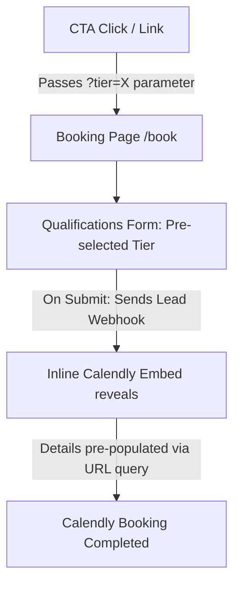

# Implementation Plan - Dedicated Strategy Booking Page (`/book`)

This plan outlines the design and integration of a high-ticket **Strategy Booking Page (`/book`)** featuring a customized lead qualification form and a seamlessly integrated, pre-filled Calendly scheduling widget.

---

## User Review Required

Please review the proposed page layout, user flow, and third-party integrations:

> [!IMPORTANT]
> **Core Mechanics Proposed:**
> 1. **Frictionless Data Handshake**: The qualification form will capture the user's name and email first. Once submitted, these details are dynamically passed to the inline Calendly widget so **the user does not have to re-type them**.
> 2. **Context-Aware Pre-selection**: If a user clicks "Start Project" on the *Legacy* tier card in the pricing page, they are routed to `/book?tier=Legacy`. The form will automatically pre-select the "Legacy" option, creating a custom, cohesive journey.
> 3. **Lead Capture Safeguard**: Form responses are captured and stored/emailed immediately upon clicking "Next." If the user drops off before scheduling on Calendly, you **still retain their contact details and business audit data**.

---

## Open Questions

> [!WARNING]
> **Details to Align On:**
> *   **Calendly Link**: What is your current Calendly scheduling link? (We will use a placeholder like `https://calendly.com/gs-legacy/strategy` until you supply yours).
> *   **Form Integration**: Where would you like form submissions sent? (e.g., direct email notifications, a Google Sheet, or CRM webhooks like Zapier/HubSpot).

---

## Proposed Changes

We will create the booking route, design the qualification component, and update the global CTAs.

---

### 1. Booking Page Setup

#### [NEW] [page.tsx](file:///c:/Users/Deepg/OneDrive/Desktop/The%20Real%20World/Campuses/AI%20Automation/New%20Lessons/CODING/v0-gs-legacy-wealth-app/app/book/page.tsx)
We will create a clean, dedicated Next.js App Router folder for `/book`. It will import our core styling, navigation header, a back-to-home button, and the booking component.

---

### 2. Interactive Booking Flow Component

#### [NEW] [booking-flow.tsx](file:///c:/Users/Deepg/OneDrive/Desktop/The%20Real%20World/Campuses/AI%20Automation/New%20Lessons/CODING/v0-gs-legacy-wealth-app/components/booking-flow.tsx)
This client component will manage the interactive pre-qualification state and the Calendly widget.

*   **State Management**:
    *   `step`: `1` (Qualification Form), `2` (Calendly Booking).
    *   `tier`: Pre-selected using Next.js `useSearchParams()` to read `?tier=` query variables.
*   **Step 1 Form Inputs**:
    *   *Full Name* & *Email Address* (Pre-fills Calendly name & email).
    *   *Website URL* & *Company Name* (Pre-fills Calendly company detail).
    *   *Selected Tier / Budget*: Launch, Legacy, Elite, Custom.
    *   *Top Obstacle*: Design Upgrade, Automation Systems, Full Brand Takeover.
*   **Step 2 Calendly Inline Embed**:
    *   Render a sleek inline frame containing the custom-themed Calendly widget.
    *   Inject custom styling parameters to force the dark luxury theme:
        `?background_color=050505&text_color=F5F5F5&primary_color=D4AF37&hide_landing_page_details=1&hide_gdpr_banner=1`
    *   Inject pre-fill query parameters:
        `&name={fullName}&email={emailAddress}&a1={websiteUrl}&a2={selectedTier}` (Calendly custom answers).

---

### 3. global Navigation and CTA Alignment

#### [MODIFY] [navbar.tsx](file:///c:/Users/Deepg/OneDrive/Desktop/The%20Real%20World/Campuses/AI%20Automation/New%20Lessons/CODING/v0-gs-legacy-wealth-app/components/navbar.tsx)
*   Update the desktop header CTA button and mobile CTAs from linking to `/ #contact` to link directly to `/book`.

#### [MODIFY] [pricing.tsx](file:///c:/Users/Deepg/OneDrive/Desktop/The%20Real%20World/Campuses/AI%20Automation/New%20Lessons/CODING/v0-gs-legacy-wealth-app/components/pricing.tsx)
*   Update the buttons on the pricing cards to link to `/book?tier=Launch`, `/book?tier=Legacy`, and `/book?tier=Elite` respectively.

#### [MODIFY] [cta.tsx](file:///c:/Users/Deepg/OneDrive/Desktop/The%20Real%20World/Campuses/AI%20Automation/New%20Lessons/CODING/v0-gs-legacy-wealth-app/components/cta.tsx)
*   Modify the "Start Free Analysis" primary button to redirect to `/book` rather than opening a generic Calendly page.

---

## Verification Plan

### Automated Verification
*   Run `npm run build` to ensure all query hooks, typescript bindings, and router components compile seamlessly.

### Manual Verification
1.  **Context Pre-selection**: Navigate to `/book?tier=Legacy` and verify the "Legacy" option is pre-checked.
2.  **Validation**: Verify validation errors appear if name/email are improperly entered or left blank.
3.  **Calendly Integration**: Submit Step 1, verify the form submit logs a background lead event, and check that the Calendly widget loads with Name and Email already pre-populated.
