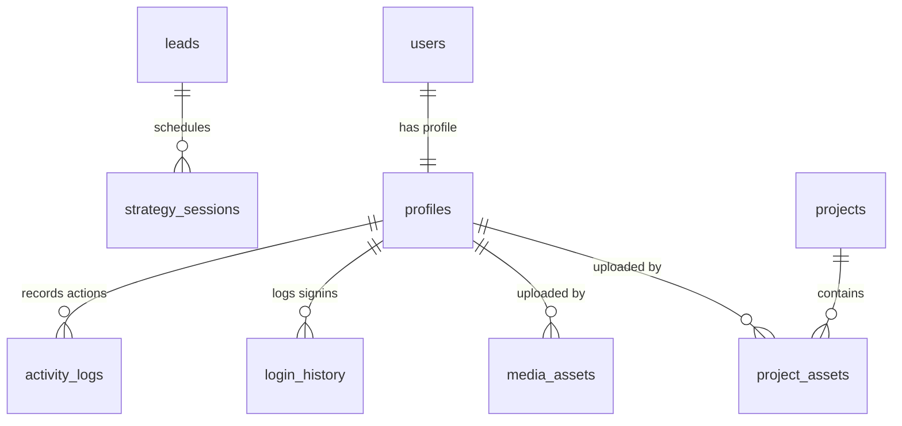
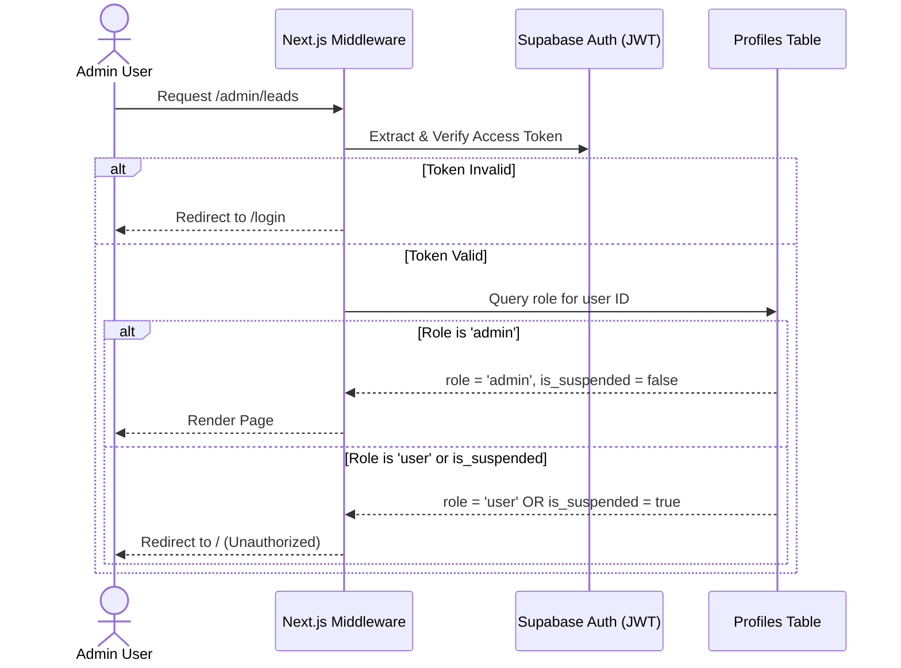
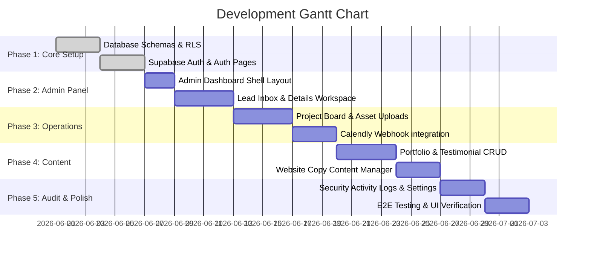

# Implementation Plan - GS Legacy Wealth AI Backend & Admin System

This document outlines the detailed, step-by-step implementation plan for adding a robust Supabase backend and a premium, luxury admin dashboard to the existing **GS Legacy Wealth AI** web application.

---

## User Review Required

> [!IMPORTANT]
> Please review the following key decisions and architectural elements. If any of these do not align with your business goals or workflow, please let us know so we can adjust before starting the build.
> * **User Role Purpose**: Since this is not a SaaS or subscription product, standard authenticated `user` accounts have no immediate access. They will be directed to a placeholder profile page or restricted from accessing the admin portal. Let us know if we should disable standard registration entirely and restrict login only to pre-created Admin accounts.
> * **Calendly Automation**: We propose a Supabase Edge Function that consumes Calendly webhooks to automatically track booked calls, match them to leads by email, and log outcomes in real-time.
> * **Website Content JSONB Structure**: The proposed structure uses a single table with JSONB documents for key layout sections (Hero, Services, Pricing, CTA, About, Footer) to enable instant schema-free content updates.

---

## Open Questions

> [!WARNING]
> 1. **Public Registrations**: Should the `/signup` page be public, or should admin registration be restricted (e.g. created manually in the Supabase dashboard or via an invite-only system)? If public, how should we safeguard the `/admin` dashboard from unauthorized access (beyond our middleware filters)?
> 2. **Calendly Webhook Setup**: Do we have access to a Calendly Professional/Teams account to set up outbound webhooks to sync bookings with the `strategy_sessions` table? If not, we will need to create an administrative manual override UI for logging strategy sessions.
> 3. **Branding Assets Management**: For the "Branding Assets" storage, is this purely for storing agency logos/banners, or should it allow admins to store and manage dynamic assets used directly in the public-facing pages (e.g., logos in header/footer, typography variations)?

---

## 1. System Architecture Overview

The GS Legacy Wealth AI administrative system is designed as a hybrid architecture combining Next.js App Router (16.2.4) with Supabase (BaaS).

```mermaid
graph TD
    subgraph Client [Next.js Web Client]
        PublicPages[Public Pages: Home, Contact, Book, Success]
        AuthPages[Auth Pages: Signup, Login, Password Recovery]
        AdminPages[Admin Dashboard: Leads, Projects, Portfolio, Testimonials, Settings, Media]
    end

    subgraph Supabase_Auth [Supabase Authentication]
        UsersTable[(auth.users)]
    end

    subgraph Supabase_Database [Supabase PostgreSQL DB]
        ProfilesTable[(public.profiles)]
        LeadsTable[(public.leads)]
        ProjectsTable[(public.projects)]
        AssetsTable[(public.project_assets)]
        PortfolioTable[(public.portfolio_items)]
        TestimonialsTable[(public.testimonials)]
        ContentTable[(public.website_content)]
        MediaTable[(public.media_assets)]
        SessionsTable[(public.strategy_sessions)]
        LoginHistory[(public.login_history)]
        ActivityLogs[(public.activity_logs)]
    end

    subgraph Supabase_Storage [Supabase Storage]
        PublicBuckets[Public: portfolio, testimonials, branding, website-media]
        PrivateBuckets[Private: project-assets]
    end

    subgraph Supabase_Edge [Supabase Edge Functions]
        CalendlyWebhook[calendly-webhook]
        AdminUserActions[admin-user-actions]
        NotifyAdmin[notify-admin]
    end

    Client -- Auth Requests --> Supabase_Auth
    Client -- GraphQL/PostgREST RLS --> Supabase_Database
    Client -- Signed URLs & Uploads --> Supabase_Storage
    Client -- Admin Actions --> AdminUserActions
    CalendlyWebhook -- Sync Event --> LeadsTable & SessionsTable
    NotifyAdmin -- Database Webhook -> Email/Discord
```

### Core Architecture Components:
* **Frontend**: Next.js App Router (React 19, TypeScript), styled with Tailwind CSS v4, Lucide React, Framer Motion, and shadcn/ui components.
* **Database (Supabase PostgreSQL)**: Holds all application data, secured by strict PostgreSQL Row Level Security (RLS) policies.
* **Authentication**: Supabase Auth handles token signing, session state, and password resets.
* **Storage (Supabase Storage)**: Holds assets separated into public and private buckets.
* **Edge Functions (Deno / TypeScript)**: Handles external Calendly webhooks, administrative user operations (e.g., user deletion/suspension requiring `service_role` keys), and notification routing.

---

## 2. Recommended Folder Structure

Integrating the admin pages into the current Next.js structure using Route Groups to keep public pages and admin layout isolated.

```text
v0-gs-legacy-wealth-app/
├── app/
│   ├── (auth)/
│   │   ├── signup/page.tsx             # Public signup (defaults to 'user' role)
│   │   ├── login/page.tsx              # Public login
│   │   ├── forgot-password/page.tsx    # Password recovery triggers
│   │   └── reset-password/page.tsx     # Callback form to set new password
│   ├── (admin)/
│   │   ├── admin/
│   │   │   ├── page.tsx                # Dashboard Overview (Lightweight Analytics)
│   │   │   ├── leads/
│   │   │   │   ├── page.tsx            # Leads List & Search / Filter UI
│   │   │   │   └── [id]/page.tsx       # Lead Details, History & Notes Editor
│   │   │   ├── projects/
│   │   │   │   ├── page.tsx            # Project Boards (Kanban layout) & List
│   │   │   │   └── [id]/page.tsx       # Project Workspace (Status progress, Assets upload)
│   │   │   ├── portfolio/
│   │   │   │   └── page.tsx            # Portfolio manager (Add/Edit/Archive UI)
│   │   │   ├── testimonials/
│   │   │   │   └── page.tsx            # Testimonials editor (Add/Edit/Archive UI)
│   │   │   ├── content/
│   │   │   │   └── page.tsx            # Section Editor (Hero, Services, Pricing, About)
│   │   │   ├── media/
│   │   │   │   └── page.tsx            # Media Library Grid (Supabase Storage explorer)
│   │   │   ├── settings/
│   │   │   │   └── page.tsx            # General settings & User management UI
│   │   │   └── logs/
│   │   │       └── page.tsx            # Security & Admin activity log viewer
│   │   ├── layout.tsx                  # Premium glassmorphic sidebar shell & provider
│   │   └── middleware.ts               # Router-level checks for JWT & 'admin' role
│   ├── contact/
│   │   └── page.tsx                    # Public agency contact form
│   ├── success/
│   │   └── page.tsx                    # Post-qualification redirect & success landing
│   ├── globals.css                     # Global styles
│   └── layout.tsx                      # Root App Layout
├── components/
│   ├── admin/
│   │   ├── sidebar.tsx                 # Luxury admin sidebar component
│   │   ├── stat-card.tsx               # Metric display card with glow effects
│   │   ├── lead-history-timeline.tsx   # Activity stream for leads
│   │   ├── project-milestones.tsx      # Step-based horizontal indicator
│   │   └── media-dropzone.tsx          # Drag-and-drop secure files upload
│   └── ui/                             # shadcn/ui components (table, card, dialog, etc.)
├── lib/
│   ├── supabase/
│   │   ├── client.ts                   # Client-side Supabase SDK instance
│   │   ├── server.ts                   # Server-side client generator (cookies support)
│   │   └── middleware.ts               # Session refresher for middleware
│   └── utils.ts                        # Helper functions (cn class merging, formatting)
├── supabase/
│   ├── config.toml                     # Local Supabase dev config
│   ├── migrations/
│   │   ├── 20260531000000_schema.sql   # Postgres core schemas & enums
│   │   └── 20260531100000_rls.sql      # RLS & Storage policies
│   └── functions/
│       ├── calendly-webhook/           # Calendly event webhook listener
│       ├── admin-user-actions/         # Secure user suspension & roles updater
│       └── notify-admin/               # Webhook for Discord/Slack alert routing
```

---

## 3. Database Schema Plan

We will create a structured PostgreSQL schema in Supabase. The database includes relationships, indexes on frequently queried fields, and audit history capabilities.



### PostgreSQL Enums
```sql
CREATE TYPE user_role AS ENUM ('admin', 'user');
CREATE TYPE lead_status AS ENUM ('New', 'Contacted', 'Call Booked', 'Proposal Sent', 'Won', 'Lost');
CREATE TYPE project_status AS ENUM ('Discovery', 'Design', 'Development', 'Revision', 'Complete');
CREATE TYPE booking_status AS ENUM ('Scheduled', 'Canceled', 'No Show', 'Completed');
```

### Tables Outline

#### 1. `profiles`
Tracks user specific identities, custom roles, and administrative statuses. Directly extends Supabase `auth.users`.
```sql
CREATE TABLE public.profiles (
    id UUID PRIMARY KEY REFERENCES auth.users(id) ON DELETE CASCADE,
    full_name TEXT,
    avatar_url TEXT,
    role user_role DEFAULT 'user'::user_role NOT NULL,
    is_suspended BOOLEAN DEFAULT FALSE NOT NULL,
    created_at TIMESTAMPTZ DEFAULT now() NOT NULL,
    updated_at TIMESTAMPTZ DEFAULT now() NOT NULL
);
```

#### 2. `leads`
Captures inbound inquiries, contact submissions, and qualified scheduling inputs.
```sql
CREATE TABLE public.leads (
    id UUID PRIMARY KEY DEFAULT gen_random_uuid(),
    name TEXT NOT NULL,
    business_name TEXT NOT NULL,
    email TEXT NOT NULL,
    phone TEXT,
    website TEXT,
    service_interested TEXT,
    notes TEXT,
    status lead_status DEFAULT 'New'::lead_status NOT NULL,
    source TEXT DEFAULT 'website' NOT NULL, -- e.g., 'contact', 'book-qualifier', 'direct'
    is_archived BOOLEAN DEFAULT FALSE NOT NULL,
    created_at TIMESTAMPTZ DEFAULT now() NOT NULL,
    updated_at TIMESTAMPTZ DEFAULT now() NOT NULL
);
```

#### 3. `projects`
Tracks active client build cycles, assets, milestones, and timelines.
```sql
CREATE TABLE public.projects (
    id UUID PRIMARY KEY DEFAULT gen_random_uuid(),
    client_name TEXT NOT NULL,
    project_name TEXT NOT NULL,
    description TEXT,
    service_type TEXT,
    status project_status DEFAULT 'Discovery'::project_status NOT NULL,
    start_date DATE,
    target_launch_date DATE,
    notes TEXT,
    is_archived BOOLEAN DEFAULT FALSE NOT NULL,
    created_at TIMESTAMPTZ DEFAULT now() NOT NULL,
    updated_at TIMESTAMPTZ DEFAULT now() NOT NULL
);
```

#### 4. `project_assets`
Maintains records of uploaded files related to a specific project.
```sql
CREATE TABLE public.project_assets (
    id UUID PRIMARY KEY DEFAULT gen_random_uuid(),
    project_id UUID REFERENCES public.projects(id) ON DELETE CASCADE NOT NULL,
    file_name TEXT NOT NULL,
    file_url TEXT NOT NULL,
    file_size BIGINT,
    file_type TEXT,
    uploaded_by UUID REFERENCES public.profiles(id) ON DELETE SET NULL,
    created_at TIMESTAMPTZ DEFAULT now() NOT NULL
);
```

#### 5. `portfolio_items`
Stores the portfolio of completed works for the public website showcase.
```sql
CREATE TABLE public.portfolio_items (
    id UUID PRIMARY KEY DEFAULT gen_random_uuid(),
    project_name TEXT NOT NULL,
    client_name TEXT,
    description TEXT,
    industry TEXT,
    website_link TEXT,
    cover_image TEXT NOT NULL, -- Storage URL
    gallery_images TEXT[] DEFAULT '{}'::TEXT[] NOT NULL, -- Array of storage URLs
    is_featured BOOLEAN DEFAULT FALSE NOT NULL,
    is_archived BOOLEAN DEFAULT FALSE NOT NULL,
    created_at TIMESTAMPTZ DEFAULT now() NOT NULL,
    updated_at TIMESTAMPTZ DEFAULT now() NOT NULL
);
```

#### 6. `testimonials`
Stores curated feedback received from clients.
```sql
CREATE TABLE public.testimonials (
    id UUID PRIMARY KEY DEFAULT gen_random_uuid(),
    client_name TEXT NOT NULL,
    company TEXT,
    testimonial TEXT NOT NULL,
    profile_image TEXT, -- Storage URL
    is_featured BOOLEAN DEFAULT FALSE NOT NULL,
    is_archived BOOLEAN DEFAULT FALSE NOT NULL,
    created_at TIMESTAMPTZ DEFAULT now() NOT NULL,
    updated_at TIMESTAMPTZ DEFAULT now() NOT NULL
);
```

#### 7. `website_content`
Stores key landing page information to avoid hardcoding copy details.
```sql
CREATE TABLE public.website_content (
    id UUID PRIMARY KEY DEFAULT gen_random_uuid(),
    section_key TEXT UNIQUE NOT NULL, -- e.g. 'hero', 'services', 'pricing', 'about', 'footer'
    content JSONB NOT NULL, -- Schema-less structured copy & config values
    updated_at TIMESTAMPTZ DEFAULT now() NOT NULL,
    updated_by UUID REFERENCES public.profiles(id) ON DELETE SET NULL
);
```

#### 8. `media_assets`
Serves as the internal catalog index for all assets saved within Supabase Storage.
```sql
CREATE TABLE public.media_assets (
    id UUID PRIMARY KEY DEFAULT gen_random_uuid(),
    bucket_name TEXT NOT NULL,
    file_path TEXT NOT NULL,
    file_url TEXT NOT NULL,
    file_name TEXT NOT NULL,
    file_size BIGINT,
    mime_type TEXT,
    uploaded_by UUID REFERENCES public.profiles(id) ON DELETE SET NULL,
    created_at TIMESTAMPTZ DEFAULT now() NOT NULL
);
```

#### 9. `strategy_sessions`
Houses Calendly booking instances and records outcomes.
```sql
CREATE TABLE public.strategy_sessions (
    id UUID PRIMARY KEY DEFAULT gen_random_uuid(),
    lead_id UUID REFERENCES public.leads(id) ON DELETE SET NULL,
    calendly_event_id TEXT UNIQUE, -- Prevents duplicate entries on webhook retry
    scheduled_at TIMESTAMPTZ NOT NULL,
    status booking_status DEFAULT 'Scheduled'::booking_status NOT NULL,
    notes TEXT,
    outcomes TEXT,
    created_at TIMESTAMPTZ DEFAULT now() NOT NULL,
    updated_at TIMESTAMPTZ DEFAULT now() NOT NULL
);
```

#### 10. `login_history`
Security log audit tracking authentication history.
```sql
CREATE TABLE public.login_history (
    id UUID PRIMARY KEY DEFAULT gen_random_uuid(),
    user_id UUID REFERENCES public.profiles(id) ON DELETE CASCADE NOT NULL,
    ip_address TEXT,
    user_agent TEXT,
    logged_at TIMESTAMPTZ DEFAULT now() NOT NULL
);
```

#### 11. `activity_logs`
Tracks modifications, actions, and archives performed by administrative users.
```sql
CREATE TABLE public.activity_logs (
    id UUID PRIMARY KEY DEFAULT gen_random_uuid(),
    user_id UUID REFERENCES public.profiles(id) ON DELETE SET NULL,
    action_type TEXT NOT NULL, -- e.g., 'CREATE_LEAD', 'UPDATE_PROJECT', 'ARCHIVE_PORTFOLIO'
    target_table TEXT,
    target_id UUID,
    details JSONB,
    created_at TIMESTAMPTZ DEFAULT now() NOT NULL
);
```

### PostgreSQL Performance Indexes
```sql
-- Speed up lead sorting/filtering
CREATE INDEX idx_leads_status_archived ON public.leads(status, is_archived);
CREATE INDEX idx_leads_email ON public.leads(email);

-- Index projects status and archives
CREATE INDEX idx_projects_status_archived ON public.projects(status, is_archived);

-- Index public facing items for landing page reads
CREATE INDEX idx_portfolio_featured_archived ON public.portfolio_items(is_featured, is_archived);
CREATE INDEX idx_testimonials_featured_archived ON public.testimonials(is_featured, is_archived);

-- Index strategy sessions by scheduled date
CREATE INDEX idx_strategy_sessions_date ON public.strategy_sessions(scheduled_at);

-- Security logs index
CREATE INDEX idx_activity_logs_user ON public.activity_logs(user_id, created_at DESC);
```

### Postgres Trigger Functions

#### Automatic User Profile Generator
Fires when a record joins `auth.users` to provision a record inside `public.profiles`.
```sql
CREATE OR REPLACE FUNCTION public.handle_new_user()
RETURNS TRIGGER AS $$
BEGIN
    INSERT INTO public.profiles (id, full_name, avatar_url, role)
    VALUES (
        new.id,
        new.raw_user_meta_data->>'full_name',
        new.raw_user_meta_data->>'avatar_url',
        'user'::user_role -- Defaut role
    );
    RETURN NEW;
END;
$$ LANGUAGE plpgsql SECURITY DEFINER;

CREATE TRIGGER on_auth_user_created
    AFTER INSERT ON auth.users
    FOR EACH ROW EXECUTE FUNCTION public.handle_new_user();
```

#### Automatic Date Updater Trigger
Standard update modifier function applied to every dynamic table to update the `updated_at` column.
```sql
CREATE OR REPLACE FUNCTION public.set_current_timestamp_updated_at()
RETURNS TRIGGER AS $$
BEGIN
    NEW.updated_at = now();
    RETURN NEW;
END;
$$ LANGUAGE plpgsql;
```

---

## 4. Authentication & Roles Strategy

We rely on Supabase Auth. User profiles contain roles mapped inside `public.profiles.role`.



### Role Access Policies
* **Admin**: Unrestricted read/write capability to all schemas and files. Access to the `/admin/*` routes.
* **User (Default)**: Restricted access. Standard landing page visitors/clients who submit contact forms do not need authentication. If they register, they will be given the `user` role and will be restricted from accessing the admin dashboard.

### Security Implementation details:
1. **Next.js Middleware**: Checks the session token on requests to `/admin/*`. Reads the `role` and `is_suspended` properties from the cached database user profile. If unauthorized or suspended, immediate redirect to `/login` occurs.
2. **Access Revocation**: If `is_suspended` changes to `true`, the database profile update triggers session token invalidation next time token validation fires (using short-lived tokens, 1 hour max, refreshed using secure HTTP-only cookies).
3. **Admin Actions Edge Function**: To perform commands such as user deletion or suspension, a custom API is used since standard users do not have permissions to write directly to auth user schemas. The Next.js frontend calls the `admin-user-actions` Edge Function, which authenticates the admin's JWT and uses the `service_role` key to interact with `auth.admin.deleteUser` or update roles.

---

## 5. Dashboard Architecture

The Admin Dashboard (/admin) serves as a minimal, high-aesthetic executive cockpit. It prioritizes layout cleanliness, high contrast readability, and concise metrics.

### Lightweight Metrics (KPI Grid)
* **Total Leads**: Total leads collected.
* **New Leads**: Count of leads in "New" status.
* **Leads This Month**: Flow of leads captured inside the active month.
* **Active Projects**: Count of projects with status `Discovery`, `Design`, `Development`, or `Revision`.
* **Completed Projects**: Total projects in `Complete` status.
* **Portfolio & Testimonial Counts**: Totals for marketing items.

### Visualization & Interactive UI
* **Lead Flow Trend**: A clean line graph using `recharts` mapping lead counts per day over the current month.
* **Project Status Breakdown**: A gold-tinted ring chart displaying projects grouped by phase.
* **Recent Activity Log Widget**: Scrollable list of the latest 5 database modifications (pulled from `activity_logs`).
* **Strategy Sessions Timeline**: Carousel component highlighting upcoming meetings.

---

## 6. Lead Management Structure

The Leads module acts as a central inbox for contact requests and booking qualifier outputs.

### Interface Details
* **List View**: A premium datatable with column sorting (`Name`, `Business`, `Website`, `Interested Service`, `Status`, `Submitted Date`).
* **Filtering Sidebar**: Quick multi-select filtering based on `Status`, `Service Type` and `Source` (e.g., website qualifier vs direct intake).
* **Search Bar**: Quick full-text search matching name, email, and business name.

### Lead Workspace (`/admin/leads/[id]`)
* **Notes Area**: Auto-saving text area for internal client history.
* **Status Dropdown**: Changes status with interactive states. Changing a status to "Call Booked" or "Won" triggers inline quick-action workflows.
* **Associated Bookings Box**: Displays details from the `strategy_sessions` table matching the lead's email.
* **Archive Trigger**: Soft-deletes the lead by toggling `is_archived` to `true` (removes it from default table views).

---

## 7. Project Management Structure

Tracks active client website production lifecycles.

### Project Tracking System
* **Board View**: A Kanban interface dividing projects into vertical status columns: `Discovery` -> `Design` -> `Development` -> `Revision` -> `Complete`.
* **List View**: Sorting layout showing targets, clients, start dates, and asset indicators.

### Project Workspace (`/admin/projects/[id]`)
* **Interactive Timeline**: Progress indicator component showing active milestone details.
* **Metadata Editor**: Manage start dates, launch dates, client contacts, and developer notes.
* **Project Assets Module**:
  * Displays file types, size indicators, and uploader identity.
  * Drag-and-drop file upload target. Files are uploaded directly to the private `project-assets` bucket and registered in the `project_assets` database table.

---

## 8. Portfolio & Testimonials Structure

Allows administrative control over the public-facing content.

### Portfolio Manager (`/admin/portfolio`)
* **Grid Dashboard**: Displays card previews of current items showing cover status, featured indicator, and category tags.
* **Editor Modal / Page**:
  * Inputs: Project Name, Client, Industry, Live Link, Description.
  * Cover Image Selector: Simple single file uploader.
  * Gallery Selector: Drag-and-drop multi-file input (stores images as array string pointers to Supabase Storage).
  * Toggle: `is_featured` (adds highlight borders on public landing page).

### Testimonials Manager (`/admin/testimonials`)
* **List Grid**: Shows client names, feedback summaries, profile images, and ordering weights.
* **Editor Flow**:
  * Inputs: Client Name, Company, Profile Image, Testimonial text.
  * Toggle: `is_featured` (dictates inclusion in home page testimonial carousel).

---

## 9. File Storage Structure

Uses Supabase Storage for secure media assets.

### Buckets Matrix

| Bucket Name | Access Level | Allowed Mime Types | Security Policies |
| :--- | :--- | :--- | :--- |
| `portfolio` | Public | `image/jpeg`, `image/png`, `image/webp` | Read: Anonymous. Write/Delete: Admins only. |
| `testimonials` | Public | `image/jpeg`, `image/png`, `image/webp` | Read: Anonymous. Write/Delete: Admins only. |
| `branding` | Public | `image/jpeg`, `image/png`, `image/svg+xml` | Read: Anonymous. Write/Delete: Admins only. |
| `website-media`| Public | `image/*`, `video/mp4` | Read: Anonymous. Write/Delete: Admins only. |
| `project-assets`| Private | * (Images, PDFs, ZIPs, source design files) | Read: Admins & associated Client ID. Write/Delete: Admins only. |

### RLS Storage Policies (SQL Implementation Example)
```sql
-- Grant read permission to everyone on public buckets
CREATE POLICY "Public Read Access"
ON storage.objects FOR SELECT
USING (bucket_id IN ('portfolio', 'testimonials', 'branding', 'website-media'));

-- Restrict write/update permissions to admin profiles only
CREATE POLICY "Admin CRUD Access"
ON storage.objects FOR ALL
TO authenticated
USING (
  EXISTS (
    SELECT 1 FROM public.profiles
    WHERE profiles.id = auth.uid() AND profiles.role = 'admin'::user_role
  )
);
```

---

## 10. API / Edge Function Plan

Uses Deno-powered Supabase Edge Functions for secure integration tasks.

### 1. `calendly-webhook`
* **Trigger**: Webhook payload received from Calendly (`invitee.created` or `invitee.canceled`).
* **Logic**:
  1. Validate webhook signature.
  2. Parse lead details (Name, Email, Scheduled date).
  3. Query `public.leads` by email. If lead does not exist, create a new record.
  4. Upsert booking state into `public.strategy_sessions`, referencing the found/created `lead_id`.
  5. Set lead status to `'Call Booked'`.

### 2. `admin-user-actions`
* **Trigger**: POST request from admin panel frontend.
* **Security**: Validates caller's authorization token; verifies the sender profile contains the `'admin'` role.
* **Logic**:
  1. Receives payload: `{ target_user_id: "uuid", action: "suspend" | "unsuspend" | "delete" }`.
  2. Uses Supabase's `service_role` key (bypassing public API limitations) to lock user logins or permanently delete users.
  3. Updates the target profile status in the database.

### 3. `notify-admin`
* **Trigger**: PostgreSQL DB Webhook (`AFTER INSERT ON public.leads` or `AFTER INSERT ON public.strategy_sessions`).
* **Logic**:
  1. Receives database record details.
  2. Compiles a summary notification.
  3. Forwards notification payload to Discord or Slack webhook for admin alert delivery.

---

## 11. UI/UX Design System (Luxury Styling Guide)

Matches the premium, dark-matte branding of the **GS Legacy Wealth AI** landing pages.

### Style System Details

#### Color System
* **App Canvas**: Matte Black `#050505` (using `bg-background`).
* **App Sheets / Cards**: Obsidian Grey `#111111` (using `bg-card`).
* **Active Accent / Primary**: Metallic Gold `#D4AF37` (using `text-gold` / `border-gold`).
* **Light Accent**: Cream Gold `#F5D76E`.
* **Standard Text**: Matte White `#F5F5F5` and Cream Grey `#B8B8B8` for secondary text.
* **Borders**: Charcoal Accent `#2a2a2a` or Gold Highlight `border-gold/10`.

#### Typography
* **Primary Headers**: `Playfair Display` or `Cormorant Garamond` (classic serif, conveys legacy and high value).
* **UI Label & Paragraphs**: `Inter` (sans-serif, ensures interface clarity at small resolutions).

#### Elements Style Guide
* **Card Design**: Glassmorphism containers using backdrop blur filter and 1px border.
  ```css
  .glass-card {
    background: rgba(17, 17, 17, 0.75);
    backdrop-filter: blur(20px);
    border: 1px solid rgba(212, 175, 55, 0.15);
    box-shadow: 0 4px 30px rgba(0, 0, 0, 0.5);
  }
  ```
* **Inputs & Forms**: Dark input boxes containing thin active outlines. Highlights are limited to gold accents.
* **Button Hierarchy**:
  * *Primary action*: Solid gradient background (`from-[#D4AF37] to-[#F5D76E]`) with black text and subtle gold glow effects.
  * *Secondary action*: Transparent layout with a gold border. Hovering triggers subtle gold scaling transitions.
  * *Destructive action*: Soft dark red boundary highlight.
* **Layout Navigation**: Locked left sidebar using vertical list items, clean spacing, and simple iconography.
* **Transition States & Skeletons**: Gold spinner animations. Tab navigation and listing refreshes utilize smooth motion fades.

---

## 12. Security Recommendations

### Row Level Security (RLS)
* **Tables locked**: RLS enabled on all database tables.
* **Strict Admin Polices**: Standard select policies permit public reads on portfolio/testimonials. Write privileges require checked authorization headers.

### Upload Verification
* Check mime types and limit storage payloads to prevent massive uploads (e.g., maximum 50MB for project files, 2MB for testimonials).
* Prevent public access to the private `project-assets` bucket. Use Supabase SDK to generate short-lived signed download links (15-minute expiry).

### Validation
* Use `zod` to validate API parameters on the server and form entries on the client.

### Logs Auditing
* Postgres triggers on update/delete events in leads, projects, and users to record actions inside the `activity_logs` table.

---

## 13. Scalability Roadmap

* **Stripe Payments**: Ensure database tables contain billing parameters. This setup prepares for future client payment status syncing.
* **Client Dashboard Access**: The `profiles` layout contains user identification options. Future iterations can allow clients to log in to view their active project status directly.
* **AI Chatbot Integration**: Database schema structure provides the core framework for connecting webhook pipelines. Chatbots can reference `website_content` and `portfolio_items` tables directly to answer client inquiries.
* **Native Booking Systems**: Strategy session data structure contains standard booking outcomes fields, facilitating a future migration from Calendly to a native schedule builder.

---

## 14. Suggested Development Phases



### Phase Details

* **Phase 1: Foundation & Security** (Days 1–6) - **[COMPLETED]**
  * Run migrations creating database schemas, indexes, and user profiling triggers.
  * Enable RLS security guidelines.
  * Design auth templates: Login, Reset, forgot-password.

* **Phase 2: Administrative Foundation** (Days 7–12)
  * Draft dashboard layouts, sidebars, and theme styling.
  * Create metrics display charts using mock data.
  * Build the lead inbox view, search tools, and details pages.

* **Phase 3: Operational Integrations** (Days 13–19)
  * Build project pipelines (Kanban boards and detailed milestone trackers).
  * Build the private `project-assets` upload targets.
  * Implement the Calendly webhook receiver function.

* **Phase 4: Content Management** (Days 20–26)
  * Set up public storage structures.
  * Build UI modules editing portfolio projects and testimonials.
  * Set up the website content editor updating landing page data.

* **Phase 5: Refinements & Handover** (Days 27–32)
  * Set up security activity logging displays.
  * Design visual loaders and error interfaces.
  * Run tests checking permissions, flows, and responsive layouts.

---

## 15. MVP vs Future Features

| Feature Component | MVP Build Scope | Future Integration Scope |
| :--- | :--- | :--- |
| **Lead Tracking** | Full DB Capture, Details log, status changes. | Auto email follow-ups via Mailgun/Resend. |
| **Bookings** | Calendly sync webhook & manual logs. | Integrated scheduler, native slot picker. |
| **Projects** | Board tracking & simple file sharing. | Client login access portal, interactive chats. |
| **Branding Assets**| Storage bucket and catalog listings. | Brand design style compiler & editor. |
| **Payments** | Predefined schema definitions (offline records).| Stripe checkout endpoints & invoice triggers. |

---

## 16. Risks & Considerations

1. **Webhook Deliveries**:
   * *Risk*: Webhook requests from Calendly might fail or arrive out of order.
   * *Mitigation*: The `strategy_sessions` schema implements unique indexes on webhook events, and the Edge Function contains defensive lookups to verify matching lead records.
2. **Access Control Leakage**:
   * *Risk*: Administrative users mistakenly assigning access permissions to standard registrations.
   * *Mitigation*: Ensure user signups are default-mapped to the standard user role, and only database console interventions or authenticated admin functions can modify roles to administrative levels.
3. **Storage Quotas**:
   * *Risk*: Massive file uploads exhausting storage volume limits.
   * *Mitigation*: Add payload limits on frontend upload dialogs and storage policies.

---

## 17. Final Recommendations

1. **Environment Separation**: Maintain two distinct Supabase environments (`Development` and `Production`). Run all migrations locally or inside the Dev dashboard before applying schema updates to Production.
2. **Admin-Only Registrations**: Disable standard public user registration in Supabase Auth config. Instead, use invitations or seed administrators directly from the console to eliminate access risk.
3. **Error Monitoring**: Install Sentry or use Logfire to log Edge Function execution issues and database query exceptions.
