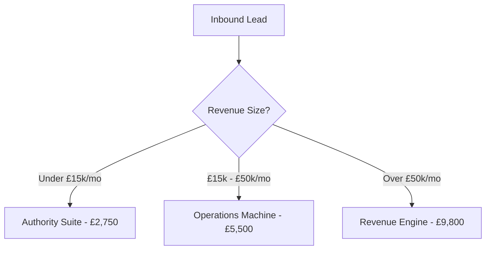

# Strategic Blueprint: Scaling to £10,000/Month & System Optimization

This document outlines a strategic roadmap and copy overhaul designed to scale **GS Legacy Wealth**'s digital systems agency to a reliable £10,000+ monthly revenue run-rate. It combines high-value one-time implementations with stable monthly recurring revenue (MRR) retainers, followed by a thorough UX/UI integrity checklist to eliminate potential conversion bottlenecks on any device size.

---

## Part 1: The £10,000/Month Revenue Strategy

Relying solely on one-off £1,500 web design projects creates a constant client-acquisition treadmill (requiring 7 clients/month to hit £10k). By shifting positioning from a "web design agency" to an **autonomic systems engineering firm**, we can charge premium prices, bundle operational tools, and transition clients into sticky monthly retainers.

### The Math to £10k/Month (Example Mix)
*   **3 x Tier 1 (Authority Suite) Builds** @ £2,750 = **£8,250**
*   **4 x Pilot Retainers** @ £499/mo = **£1,996**
*   **Total Monthly Yield = £10,246**
*(Alternatively, just one Tier 3 Enterprise build at £10,000 completes the goal in a single transaction).*

---

## Part 2: Re-engineered Pricing Packages & High-Yield Copy

We will change the offers to showcase the developer's exact skill set: custom frontend web dev, custom backend admin panels, database management, Stripe billing, Calendly booking, and cold outreach automation.

### 1. One-Time Setup Tiers (Systems & Assets)



#### **Tier 1: The Authority Suite**
*   **Focus**: Rapid Client Acquisition & Custom Branding.
*   **Target**: High-ticket service providers, consultants, and premium local brands.
*   **Price**: **£2,750** *(Deposit: £687.50 to initiate, 4 stages)*
*   **Target Copy**:
    > *"A luxury digital front-office that projects absolute authority. Engineered without templates to secure and convert elite clients."*
*   **Deliverables**:
    *   Bespoke Next.js Authority Platform (up to 5 Custom Art-Directed Pages).
    *   **Calendly Scheduling Integration**: Custom intake routing and automatic calendar sync.
    *   **Stripe Gateway Integration**: Direct payment collection (consultation deposits, services, or retainer authorizations).
    *   Core SEO Blueprint & Schema markup.
    *   Supercharged speed profile (95+ Mobile PageSpeed guarantee).
    *   30 Days Dedicated Launch Support.

#### **Tier 2: The Operations Machine (Recommended Tier)**
*   **Focus**: Eliminating Admin Drag & Automating Workflows.
*   **Target**: Established businesses ready to scale without hiring more admin staff.
*   **Price**: **£5,500** *(Deposit: £1,375 to initiate, 4 stages)*
*   **Target Copy**:
    > *"Your complete digital systems layer. We replace manual administrative overhead with custom software leverage so your business runs on autopilot."*
*   **Deliverables**:
    *   Everything in the *Authority Suite* (up to 10 Pages).
    *   **Custom Backend Admin Portal**: A secure dashboard for your staff to manage leads, track project stages, and view CRM analytics.
    *   **Custom Client Portal**: A premium, white-labeled client workspace for file transfers, updates, and sign-offs.
    *   **Autonomic System Automations**: Tailored pipelines routing leads from forms into CRM, Slack, and email notifications in under 5 seconds.
    *   Automated billing and invoice generation via Stripe.
    *   90 Days Launch Support.

#### **Tier 3: The Revenue Engine Suite**
*   **Focus**: Aggressive Outbound Prospecting & Scale.
*   **Target**: High-ticket agencies, consultancy firms, and B2B operators.
*   **Price**: **£9,800** *(Deposit: £2,450 to initiate, 4 stages)*
*   **Target Copy**:
    > *"The ultimate growth and automation infrastructure. We build a high-performance brand platform, launch your automated cold email prospecting system, and program your AI lead triage."*
*   **Deliverables**:
    *   Everything in the *Operations Machine* (Unlimited pages).
    *   **Bespoke Cold Email Outreach System**: Domain setup, warm-up sequencing, copywriting rotation, automated follow-ups, and scrapers piping leads directly to your inbox.
    *   **Bespoke AI Agent Concierge**: Custom-trained AI chat agent that handles client queries, qualifies intent, and books meetings 24/7/365.
    *   Full Brand Identity Suite (Logos, premium typography guidelines, and slide decks).
    *   Priority Founder Hotline via dedicated Slack Channel.

---

### 2. Monthly Retainer Tiers (Operational Support)

To build a valuation multiplier for the agency, recurring revenue is essential.

| Feature / Service | **Pilot Support** (£499/mo) | **Co-Pilot Growth** (£1,290/mo) | **Enterprise Autonomic Partner** (£2,850/mo) |
| :--- | :---: | :---: | :---: |
| **Premium Web Hosting** | Ultra-Fast CDN | Ultra-Fast CDN + Cache Optimization | Enterprise Isolated Server |
| **Critical Maintenance** | Weekly Security Audits | Weekly Audits + API Health Checks | Real-Time Telemetry & Failover |
| **Developer/Designer Support** | 3 Hours/mo | 10 Hours/mo | Unlimited Minor Modifications |
| **AI Agent Re-training** | — | Monthly knowledge base updates | Weekly fine-tuning & prompt audits |
| **Growth Assets** | — | 1 High-converting landing page/mo | Custom workflow automation builds |
| **Slack Concierge** | Email/Portal (24h) | Slack (4h response) | Instant Direct Founder Slack Hotline |

---

## Part 3: Modal & Button Navigation Audit

A comprehensive map of all user interaction points and their targets, ensuring zero user journey friction:

```
[Landing Page Header] ----------> /book (Qualification Flow)
[Hero Primary CTA] --------------> /book (Qualification Flow)
[Hero Secondary CTA] ------------> /portfolio
[Services - Learn More] --------> Open detail modal
   └─ [Modal CTA Button] -------> /book?service=service-name
[Portfolio - Hover Link] -------> If under construction: Open waitlist modal
                                  If live: Open iframe preview modal
[Pricing Card CTA] -------------> /book?tier=tier-name
[ROI Calculator Recommended] ---> /book?tier=recommended-tier
[Footer Links] ─────────────────> Navigates to corresponding static sub-pages
```

### UX Observations & Potential Vulnerabilities
1.  **Sticky Header Occlusion on Scroll Targets**:
    > [!IMPORTANT]
    > In `components/booking-flow.tsx`, navigating between sub-steps (e.g. from page 1 to page 2) triggers a smooth scroll to the top of the container: `containerRef.current?.scrollIntoView({ behavior: 'smooth', block: 'start' })`. 
    > Because the main `<Navbar />` is `fixed top-0 left-0 right-0 z-50` (occupying 80px), scrolling an element to the "start" of the viewport aligns its top edge with the absolute top of the screen. This means the top **80px of the form is covered by the sticky navbar**, hiding the question number and progress indicator.
    >
    > **Solution**: Use `scroll-margin-top: 100px` (or `scroll-mt-24` in Tailwind) on the form container, or trigger a custom JavaScript window scroll with an offset:
    > ```javascript
    > const yOffset = -100; 
    > const y = element.getBoundingClientRect().top + window.pageYOffset + yOffset;
    > window.scrollTo({ top: y, behavior: 'smooth' });
    > ```

2.  **Iframe Sandboxing & Embed Constraints**:
    *   The `SitePreviewModal` renders client websites inside an iframe. If an external client site includes security headers like `X-Frame-Options: DENY` or `Content-Security-Policy: frame-ancestors 'none'`, the browser will refuse to load the preview, displaying a blank container or a browser connection error.
    *   **Solution**: Ensure that for any sites added to the live portfolio, your web server allows embedding, or detect if the frame fails to load and display a clean fallback link saying *"Security policy restricts inline previews. Click here to open in a new tab."*

3.  **Calendly Prefill Reliability**:
    *   In `components/booking-flow.tsx`, the Calendly URL is dynamically built using `URLSearchParams` to prefill the visitor's name and email.
    *   Verify that your Calendly event form fields exactly match the default API query keys: `name` and `email` map automatically, but custom answers (like `a1`, `a2`, `a3` for website, priority, and revenue) must correspond to the correct custom question positions in your Calendly dashboard. If you rearrange the questions in Calendly, the query parameters `a1`–`a4` will map to the wrong inputs!

---

## Part 4: Multi-Device Responsive (UI/UX) Optimization Checklist

Ensuring premium, responsive execution on all screen profiles, from a compact mobile viewport (320px) to an ultra-wide monitor.

### 1. Mobile-Specific Adjustments (Under 640px)
*   **The ROI Estimator Grid**:
    On screens below 375px (e.g., iPhone SE), the grid layout `grid grid-cols-2 gap-4` inside the ROI Calculator outputs (Time Reclaimed, Growth Lift) can cause the numbers (e.g. "£12,000") and labels to wrap onto multiple lines, creating a cramped interface.
    *   *Improvement*: Wrap the metrics in a single-column column list below 400px screen width (`grid grid-cols-1 xs:grid-cols-2 gap-3`).
*   **Mobile Steppers vs. Slider Focus**:
    The current setup uses steppers (`+` / `−`) on mobile instead of standard input sliders. This is excellent practice, but the text box inside the stepper should have the `inputmode="numeric"` attribute enabled, allowing users to tap and input a specific number using a numeric keyboard if they don't want to tap `+` / `−` repeatedly.
*   **iOS Safari Iframe Scroll Freeze**:
    iOS devices often struggle to scroll inside iframes correctly. If a user opens a live website preview in `SitePreviewModal` on iOS, Safari may ignore the parent `overflow-hidden` constraints, expanding the iframe to its full height and breaking the modal design.
    *   *Improvement*: On viewports below 768px, disable the inline iframe preview entirely. Instead, make the "View Project" button redirect the user to the live external URL in a new tab immediately, optimizing mobile bandwidth and preventing layout breaks.

### 2. Tablet Layouts (640px to 1024px)
*   **Pricing Grid Wrap**:
    The pricing grid wraps dynamically: `grid sm:grid-cols-2 lg:grid-cols-3 gap-8`. On standard tablets in portrait mode (768px), this places 2 cards on the first row and 1 card centered on the second row.
    *   *Improvement*: Set `flex flex-col md:flex-row md:flex-wrap md:justify-center` or use CSS grid tweaks to ensure the third card doesn't stretch to full-width in an awkward layout.

### 3. Desktop / Ultra-wide Layouts (1024px+)
*   **Custom Cursor Performance**:
    The site uses a custom cursor element. While visually striking on high-end desktop rigs, custom cursors can introduce input latency or screen-tearing on standard 60Hz monitors, and are completely useless on touch-screen devices.
    *   *Improvement*: Ensure the custom cursor is styled with `pointer-events: none` and has a media query that completely disables it (`display: none`) on any device that supports touch interaction (`@media (hover: none)`).

---

## Part 5: Proposed Copy Refinements for Premium Conversion

To attract £5,000+ client projects, the copy must talk about **systems, operations, and ROI**, not just aesthetics.

| Current Site Headline | Proposed Copy Alternative | Rationale |
| :--- | :--- | :--- |
| **"Bespoke Bespoke Capital Investments. Measurable Yields."** | **"Bespoke Systems Architecture. Automated Pipeline Leverage."** | Avoids repeating "Bespoke" in succession and highlights the operational leverage. |
| **"We do not build administrative overhead. We deploy capital assets..."** | **"We don't build websites. We build automated client acquisition machines."** | Shorter, punchier, and immediately describes the business outcome. |
| **"Websites That Mean Business"** | **"Digital Assets Engineered for Leverage"** | Fits the high-ticket "Systems Agency" feel rather than a low-cost web design company. |
| **"Current monthly revenue..."** | **"Projected Scale & Onboarding Flow"** | Re-frames qualifying questions as strategic filters, increasing lead compliance. |

---

## Part 6: B2B Conversion Engine & Landing Page Layout Refinements

To scale to £10,000/month, the website must act as both a high-intent filter and a high-conversion capture mechanism. Below are the layout and UX sequence adjustments:

### 1. High-Conversion Page Sequence
1.  **Navbar**: Sticky positioning with a highlighted Fast-Track CTA button.
2.  **Hero**: Value hook emphasizing operational outcomes + Primary Call to Action.
3.  **Social Proof Strip**: Numbers of deployments and system uptime guarantees.
4.  **Services Tiers**: Display of the three custom systems (*Authority Suite*, *Operations Machine*, *Revenue Engine*).
5.  **Portfolio (Selected Work)**: Move this section up (previously located after Results) to showcase visual credibility and proof early in the user journey.
6.  **Bottleneck Section**: Friction points visualizer (Chaos vs. Order interactive SVG).
7.  **Interactive ROI Calculator**: Embed this section directly inline on the homepage instead of hiding it inside a modal.
8.  **Results & Client Testimonials**: Showcase case studies and real founder/operator quotes.
9.  **Process (Execution Protocol)**: Explaining the 28-day build guarantee.
10. **Why GS Legacy**: Highlighting the custom Next.js stack, no templates, and speed guarantees.
11. **Pricing**: Setup tiers & monthly retainer models with billing cycle toggle.
12. **FAQ**: Direct answers addressing common onboarding objections.
13. **Final CTA Banner**: High-contrast final audit booking button.
14. **Footer**: Clean navigation and privacy links.

### 2. High-Converting Portfolio Modal Refactor
*   **Action Request Blueprint:** Change the passive "Under Construction / Notify me when live" waitlist form to an active lead magnet: *"Request Sanitized System Schema: Enter your email to instantly receive a sanitized architectural blueprint, database schema, and Loom walkthrough of this build."*
*   **Fast-Track Low-Friction Form:** Offer a secondary 2-field form in the Hero and CTA sections: *"Request a free 5-minute Loom audit of your existing site (Email + URL)."* This bypasses the 5-step calendar qualification process to capture medium-intent leads.

